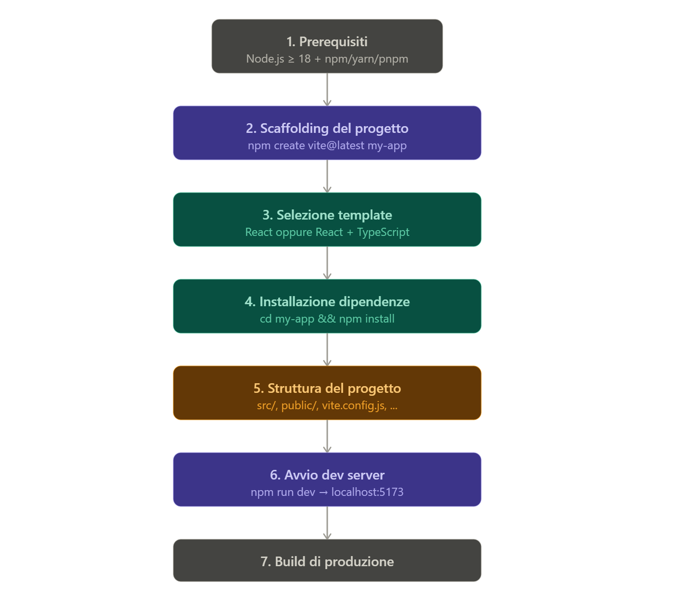

Creare un progetto React con Vite.

Struttura concettuale del processo

1. Prerequisiti

Node.js versione 18 o superiore — verificare con node -v. Vite richiede un runtime moderno per sfruttare gli ES modules nativi.
Package manager a scelta — npm (incluso con Node), yarn o pnpm. I comandi seguenti usano npm, ma la sintassi è analoga per gli altri.

2. Scaffolding del progetto
Il comando ufficiale per creare un nuovo progetto è:
-> npm create vite@latest nome-del-progetto

Vite avvia una procedura interattiva che chiede:
- Nome del progetto (se non fornito inline)
- Framework → selezionare React
- Variante → JavaScript oppure TypeScript

In alternativa, è possibile saltare le domande passando le opzioni direttamente:
-> npm create vite@latest my-app -- --template react

# oppure con TypeScript:
-> npm create vite@latest my-app -- --template react-ts

3. Installazione delle dipendenze
cd my-app
npm install

Questo scarica react, react-dom e @vitejs/plugin-react (che usa Babel per il Fast Refresh), più tutte le devDependencies.

4. Struttura del progetto generata
my-app/
├── public/              ← Asset statici serviti direttamente
│   └── vite.svg
├── src/
│   ├── assets/          ← Immagini, font, etc. (processati da Vite)
│   ├── App.css
│   ├── App.jsx          ← Componente radice
│   ├── index.css        ← CSS globale
│   └── main.jsx         ← Entry point (monta <App /> nel DOM)
├── index.html           ← Entry HTML (NON in public/)
├── package.json
└── vite.config.js       ← Configurazione Vite

index.html è nella radice del progetto, non in public/. Vite lo usa come punto di ingresso del grafo delle dipendenze.
main.jsx contiene ReactDOM.createRoot(document.getElementById('root')).render(...).

5. File vite.config.js — configurazione base

import { defineConfig } from 'vite'
import react from '@vitejs/plugin-react'

export default defineConfig({
  plugins: [react()],
})

Configurazioni utili aggiuntive:
export default defineConfig({
  plugins: [react()],
  server: {
    port: 3000,          // Cambia la porta del dev server
    open: true,          // Apre il browser automaticamente
  },
  resolve: {
    alias: {
      '@': '/src',       // Alias per import assoluti: import Foo from '@/components/Foo'
    },
  },
  build: {
    outDir: 'dist',      // Cartella output per la build (default già 'dist')
  },
})

6. Script npm disponibili
npm run dev -> Avvia il dev server su localhost:5173 con HMR
npm run build -> Genera la build ottimizzata in /dist
npm run preview -> Serve localmente la build di produzione

HMR sta per Hot Module Replacement: è il meccanismo che consente al browser di aggiornare solo il modulo JavaScript modificato, senza ricaricare l'intera pagina. Il risultato è che lo stato dell'applicazione (form compilati, posizione dello scroll, variabili in memoria) viene preservato durante lo sviluppo.

7. Build di produzione
npm run build

Vite usa Rollup internamente per il bundling.
Produce file minificati con hash nel nome (es. assets/index-BFd6rM1P.js) per il cache busting automatico.
L'output finale va nella cartella dist/, pronta per essere deployata su qualsiasi hosting statico (Netlify, Vercel, GitHub Pages, ecc.).

8. Differenze chiave rispetto a Create React App (CRA)
Aspetto             Vite                                        CRA (deprecato)     
Dev server          ES modules nativi, nessun bundling in dev   Webpack, bundling completo
Velocità avvio      ~300ms                                      5–30 secondi
HMR (hot reload)    Quasi istantaneo                            Lento su progetti grandi
Build               Rollup                                      Webpack
Configurazione      vite.config.js flessibile                   Richiede eject
Stato               Attivamente mantenuto                       Deprecato a febbraio 2025